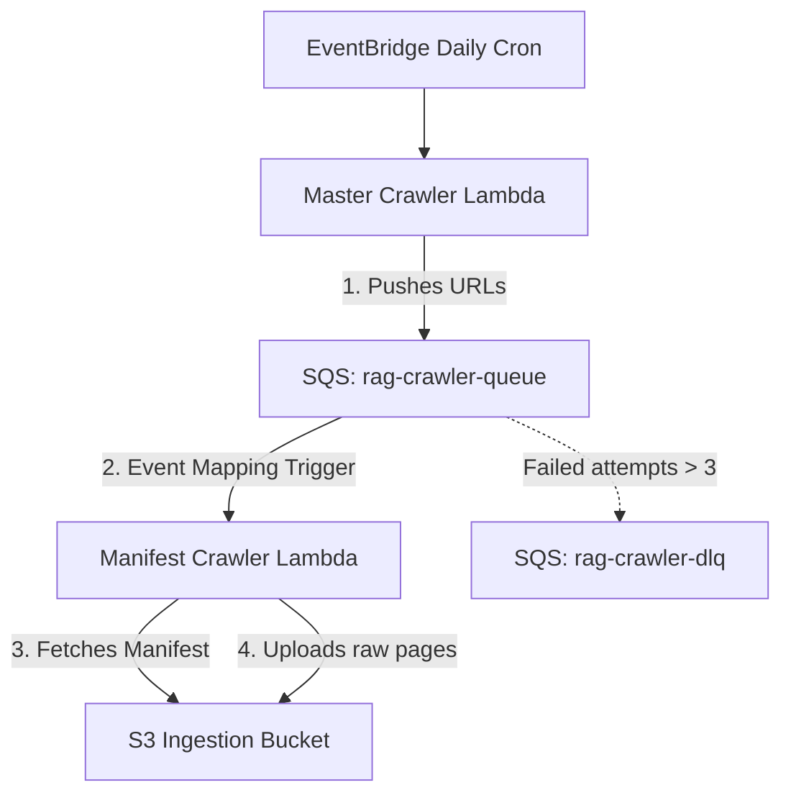
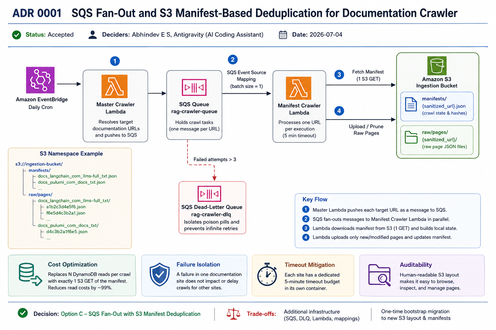

# ADR 0001: SQS Fan-Out and S3 Manifest-Based Deduplication for Documentation Crawler

* **Status**: Accepted
* **Deciders**: Abhindev E S, Antigravity (AI Coding Assistant)
* **Date**: 2026-07-04

---

## Context and Problem Statement

While the initial synchronous crawler met current functional requirements, it coupled discovery, crawling, and deduplication into a single execution path. As the number of documentation sources, crawl frequency, or document volume grows, this architecture would require significant redesign to scale efficiently. We therefore chose to evolve the ingestion pipeline proactively into an event-driven architecture, focusing on addressing the following long-term constraints:

1. **Serial Execution & Timeout Risks:** Scoping and crawling multiple site domains sequentially within a single Lambda execution runs the risk of hitting AWS Lambda's maximum 15-minute timeout as document sources are added.
2. **Costly Deduplication:** Before uploading raw pages to S3, querying a DynamoDB table key-by-key for each document URL to check for content hash matches incurs significant read request overhead (1,500+ DynamoDB Read Request Units per daily crawl), leading to unnecessary API billing as volume increases.
3. **Flat S3 Bucket Structure:** Storing raw page objects under a flat directory structure (`raw/pages/{md5_hash}.json`) reduces auditability, making it difficult to trace or browse files belonging to specific documentation sources.

---

## Decision Drivers

* **Scalability:** The system must handle crawling dozens of independent documentation endpoints in parallel.
* **Architectural Stability:** Design the ingestion pipeline so that expected growth in documentation sources, crawl volume, or processing frequency can be accommodated through horizontal scaling rather than requiring fundamental architectural changes.
* **Operational Cost:** Minimize database read/write costs (DynamoDB) and embedding costs (AWS Bedrock) by optimizing deduplication.
* **Auditability:** Provide a clear, human-readable layout of crawled documents in the S3 bucket.
* **Resilience:** Protect the system from "poison pill" inputs and endless execution retry loops on broken/offline URLs.

---

## Considered Options

* **Option A: Synchronous parallelization (asyncio)**
  * *Pros:* Simple architecture (no extra AWS services).
  * *Cons:* Limited by single Lambda resource constraints (RAM/CPU) and maximum 15-minute runtime.
* **Option B: Master-Worker SQS Fan-Out with DynamoDB Deduplication**
  * *Pros:* Fully decoupled parallel execution.
  * *Cons:* Still incurs thousands of DynamoDB reads per run to perform document deduplication.
* **Option C: Master-Worker SQS Fan-Out with S3 Manifest Deduplication (Chosen)**
  * *Pros:* Completely eliminates key-by-key DynamoDB reads. Uses structured, human-readable S3 folders and isolates failures per URL.

---

## Proposed Architecture & Decision

We chose **Option C** and implemented the following architecture:

### Key Implementation Details:

1. **Master-Worker Decoupling:**
   * A lightweight **Master Crawler Lambda** resolves the list of target crawl URLs and pushes a JSON message `{"target_url": url}` to an SQS Queue (`rag-crawler-queue`) for each URL.
   * The SQS Queue triggers the **Manifest Crawler Lambda** concurrently via SQS event source mapping with a `batch_size` of 1.
2. **S3 Manifest-Based Deduplication:**
   * Instead of DynamoDB lookup, each target URL maintains its crawl state in S3 at `manifests/{sanitized_url}.json`.
   * The Manifest Crawler downloads the manifest file (1 S3 GET request), calculates content hashes of crawled pages, performs a local dictionary diff, uploads only new/modified pages, and prunes stale pages.
3. **Dead-Letter Queue (DLQ):**
   * Configured an SQS DLQ (`rag-crawler-dlq`) with `maxReceiveCount = 3` redrive policy to isolate broken/offline URLs and prevent infinite execution retry loops.
4. **Human-Readable Namespace Layout:**
   * Sanitized URL names (e.g. `docs_langchain_com_llms-full_txt`) are used as prefixes for manifests and folders in S3 (`raw/pages/{sanitized_url}/`) instead of raw MD5 hashes.

---

## Cost Impact Analysis (FinOps)

By switching from DynamoDB key-by-key querying to S3 manifest-based state checking:
* **DynamoDB Read Savings:** For 1,500 documents, daily crawl checks drop from **1,500 DynamoDB reads** to **0 reads** (we now only do writes/updates for changed/pending files). On an annual scale, this saves **547,500 Read Request Units (RRUs)**.
* **S3 Request Overhead:** We introduce exactly **1 S3 GET request** per crawler run to fetch the manifest. 365 GET requests per year cost **$0.000146 USD** (at $0.0004 per 1,000 GET requests).
* **Net Savings:** Deduplication API cost is reduced by **99.9%** while completely decoupling database query bottlenecks.

---

## Observability & Monitoring Plan

To operationalize this decision, the following observability metrics are established:
1. **Dead-Letter Monitoring:** A CloudWatch Alarm is configured for the SQS metric `ApproximateNumberOfMessagesVisible >= 1` on the `rag-crawler-dlq`. This routes alerts directly to engineers (e.g., Slack/PagerDuty) to identify failing documentation sites immediately.
2. **Crawl Duration & Throttle Alarms:** Set up alarms for `Duration` and `Errors` on the worker Lambda to capture rate-limiting (e.g., if a documentation provider blocks our scraper).

---

## Rollback & Migration Strategy

* **Forward Migration:** Run `bootstrap_migration.py` to scan DynamoDB, move S3 files into their new sub-folders (`raw/pages/{sanitized_url}/`), and generate the initial manifest.
* **Rollback Plan:** The new manifest crawler *still* writes its final statuses back to the DynamoDB `DocumentSyncStatus` table upon successful uploads. Because DynamoDB remains the "single source of truth" for document sync statuses, we can revert to the old flat-crawler at any time without any data loss or state reconstruction requirements.
