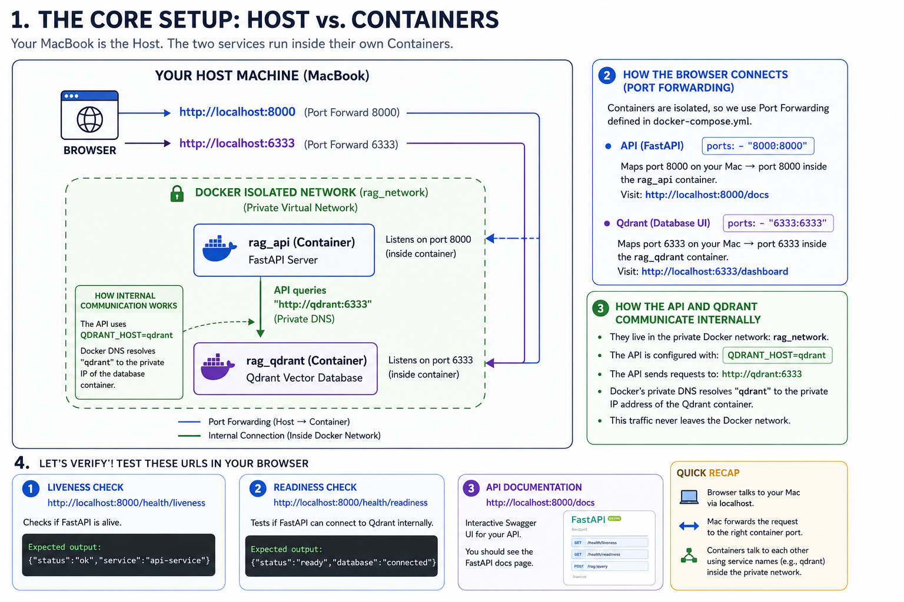

Edited Dockerfile
Viewed Dockerfile:24-38
Ran command: `docker compose down`
Ran command: `docker compose up --build -d`

Fantastic! The build succeeded, and both containers are up and running together.

Here is the "big picture" of how everything is connected, and how you are able to load these pages in your browser even though they are running inside isolated containers:

---

### 1. The Core Setup: Host vs. Containers
Your physical computer (MacBook) is the **Host**.
The two services are running inside their own **Containers** (which act like tiny, isolated virtual computers).

### 2. How the Browser connects to the Containers (Port Forwarding)
Because containers are isolated, your browser cannot access them directly by default. We bridge this gap using **Port Forwarding** defined in our `docker-compose.yml`:

* **For the API**:
  `ports: - "8000:8000"`
  * **Meaning**: *"Take port 8000 on my Mac (host) and map it directly to port 8000 inside the `rag_api` container."*
  * When you type `http://localhost:8000/docs` in your browser, your Mac forwards that request straight into the FastAPI container's Uvicorn server.
* **For Qdrant**:
  `ports: - "6333:6333"`
  * **Meaning**: *"Take port 6333 on my Mac and map it directly to port 6333 inside the `rag_qdrant` container."*
  * When you visit `http://localhost:6333/dashboard`, your browser connects to the database administration UI running inside the database container.

---

### 3. How the API and Qdrant communicate internally
Inside the Docker environment, they don't use `localhost`. They live in the private virtual network called `rag_network`:

* The API service is configured with `QDRANT_HOST=qdrant`.
* When the API needs to run the readiness check, it sends a request internally to `http://qdrant:6333`.
* Docker's private DNS resolves the word `"qdrant"` to the private IP address of the Qdrant container inside the bridge network.
* This internal connection is **completely isolated** from the outside world.

---

### Let's verify!
Since both containers are running, let's open your browser on your Mac and test the endpoints:

1. Visit **`http://localhost:8000/health/liveness`** (Checks if FastAPI is alive).
   * *Expected output*: `{"status":"ok","service":"api-service"}`
2. Visit **`http://localhost:8000/health/readiness`** (Tests if FastAPI can successfully connect to Qdrant internally).
   * *Expected output*: `{"status":"ready","database":"connected"}`
3. Visit **`http://localhost:8000/docs`** (Loads the Interactive API documentation).

Let me know what you get for the readiness check!
