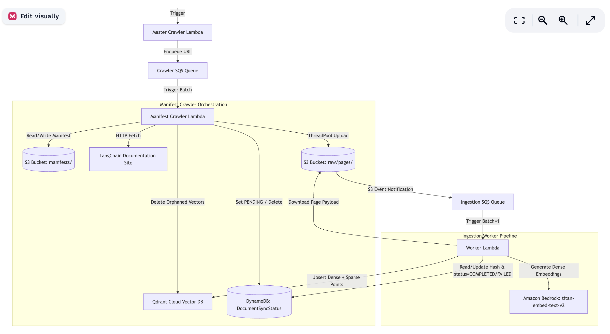

# Technical Interview Prep Guide: Phase 1 (Ingestion & Processing)

This document is a comprehensive guide to help you prepare for technical interviews regarding the **Ingestion Phase (Phase 1)** of your AWS Serverless RAG pipeline. It details the system architecture, design decisions, implementation details, and trade-offs.

---

## System Architecture

The following diagram illustrates the flow of raw document fetching, tracking, chunking, embedding, and vector database indexing:



---

## Section 1: Architecture & Decoupled Design Patterns

### Q1: Can you walk me through the high-level architecture of your document ingestion pipeline?
**Answer:**
The pipeline is a decoupled, event-driven serverless ingestion system on AWS.
1. **Triggering**: An EventBridge rule schedules a daily cron job that triggers the [Master Crawler Lambda](file:///Users/abhindeves/Developer/project-dubai/rag/week3-rag-aws/services/indexer-service/src/indexer/lambda_handler.py#L24-L71) with a list of target documentation URLs.
2. **Buffering (Crawler)**: The master crawler dispatches individual URL crawl jobs as SQS messages to a **Crawler SQS Queue**.
3. **Crawl & Manifest Check**: The [Manifest Crawler Lambda](file:///Users/abhindeves/Developer/project-dubai/rag/week3-rag-aws/services/indexer-service/src/indexer/manifest_crawler.py#L112-L195) processes these crawl jobs. It fetches the documentation list, compares the pages against a manifest stored in S3 to filter out unchanged documents, uploads new/modified pages to S3 as raw JSON payloads, and prunes orphaned pages from the index.
4. **State Transition**: When the manifest crawler uploads files to S3, it updates their state to `PENDING` in a DynamoDB state tracking table.
5. **Decoupled Processing**: S3 triggers an event notification (`s3:ObjectCreated:*`) that enqueues a message in the **Ingestion SQS Queue**.
6. **Chunking & Indexing**: The [Worker Lambda](file:///Users/abhindeves/Developer/project-dubai/rag/week3-rag-aws/services/indexer-service/src/indexer/lambda_handler.py#L163-L214) consumes from this queue (batch size = 1, maximum concurrency throttle = 2). It reads the raw JSON from S3, splits it using a custom header-aware markdown text splitter, generates dense embeddings using Amazon Bedrock (`titan-embed-text-v2`), and indexes the chunks in Qdrant Vector DB with dense vectors and server-side BM25 sparse vectors. Upon completion, the status is updated to `COMPLETED` in DynamoDB.

---

### Q2: Why did you decouple the Crawler Lambda from the Worker Lambda using S3 event notifications and SQS?
**Answer:**
Decoupling these two stages solves several production scaling issues:
* **Separation of Concerns**: Crawling/Scraping is I/O heavy (network calls to external servers) and follows a coarse schedule, whereas chunking/embedding is CPU/API rate-limited (interacting with LLM provider APIs and Vector databases).
* **Fault Tolerance & Isolation**: If an external site goes down or rate-limits our crawler, the ingestion worker remains unaffected. Conversely, if Bedrock embeddings fail or Qdrant hits a capacity limit, we don't lose the crawled documents; they remain queued safely in SQS, ready to be retried.
* **Rate-limiting and Throttling Control**: Embedding providers and Vector DBs have strict request rate limits. SQS allows us to throttle processing by adjusting the Lambda event source mapping's concurrency settings (e.g., `maximum_concurrency: 2` and `batch_size: 1` in our [Pulumi config](file:///Users/abhindeves/Developer/project-dubai/rag/week3-rag-aws/infra/__main__.py#L194-L201)). This prevents database crashes or API throttling.
* **Time Limit Constraints**: AWS Lambda has a hard 15-minute timeout. Crawling thousands of pages and embedding them all in one single run would easily exceed this timeout. Decoupling breaks the task down: the crawler finishes within minutes, and the worker processes pages in micro-batches (one message/page at a time) well within the limits.

---

## Section 2: Content State Tracking & Pruning Mechanics

### Q3: You use both an S3 Manifest and a DynamoDB table for state tracking. Why do you need both?
**Answer:**
They serve two fundamentally different purposes:
1. **S3 Manifest (`manifests/{sanitized_url}.json`)**: Acts as a **global registry** of all document IDs (URLs) crawled from a specific documentation root during the crawler execution. It is the only way to detect **deletions (orphans)**. If a document was present in a previous crawling run but is absent from the current run, we identify it by checking `orphaned_ids = set(manifest.keys()) - set(crawled_hashes.keys())` in [manifest_crawler.py](file:///Users/abhindeves/Developer/project-dubai/rag/week3-rag-aws/services/indexer-service/src/indexer/manifest_crawler.py#L154). We then prune these orphaned pages from S3, DynamoDB, and Qdrant.
2. **DynamoDB (`DocumentSyncStatus` table)**: Acts as an **asynchronous page-level state machine** for the worker threads. Since crawling and worker ingestion are asynchronous and decoupled, the system needs to track the real-time processing status of individual pages (e.g., `PENDING`, `COMPLETED`, `FAILED`). It also acts as an additional layer of idempotency: if the worker lambda receives a duplicate SQS event, it checks if the document hash is already indexed and marked `COMPLETED` in DynamoDB using [check_document_hash()](file:///Users/abhindeves/Developer/project-dubai/rag/week3-rag-aws/services/indexer-service/src/indexer/storage.py#L97-L117) and safely skips redundant work.

---

### Q4: How does the pruning workflow work when a document is deleted from the source website?
**Answer:**
When a page is deleted from the source documentation site, it will not appear in the crawl output. The pruning logic runs as follows:
1. In [run_manifest_crawler](file:///Users/abhindeves/Developer/project-dubai/rag/week3-rag-aws/services/indexer-service/src/indexer/manifest_crawler.py#L153-L189), we determine the `orphaned_ids` (keys in the S3 manifest that were *not* found in the newly crawled document list).
2. For each orphaned document ID:
   * **Delete from Qdrant**: We call `delete_document_vectors(doc_id)` in [storage.py](file:///Users/abhindeves/Developer/project-dubai/rag/week3-rag-aws/services/indexer-service/src/indexer/storage.py#L136-L153). Qdrant deletes all chunks associated with this document ID using a payload filter matches request:
     ```python
     client.delete(
         collection_name=settings.qdrant_collection,
         points_selector={"filter": {"must": [{"key": "doc_id", "match": {"value": doc_id}}]}}
     )
     ```
   * **Delete from S3**: We remove the raw page JSON payload from the S3 bucket.
   * **Delete from DynamoDB**: We remove the tracking record from the `DocumentSyncStatus` table to free up database storage.
   * **Remove from Manifest**: We pop the key from our local manifest dictionary.
3. Finally, we upload the updated manifest back to S3.

---

## Section 3: Parsing & Context-Aware Chunking Strategy

### Q5: Why did you write custom splitters instead of using the standard LangChain SDK splitters?
**Answer:**
We implemented lightweight custom versions of [MarkdownHeaderTextSplitter](file:///Users/abhindeves/Developer/project-dubai/rag/week3-rag-aws/services/indexer-service/src/indexer/custom_splitters.py#L21) and [RecursiveCharacterTextSplitter](file:///Users/abhindeves/Developer/project-dubai/rag/week3-rag-aws/services/indexer-service/src/indexer/custom_splitters.py#L125).
The primary reasons are **cold start performance** and **deployment package limits** in AWS Lambda:
* **Package Overhead**: LangChain is a massive framework with hundreds of dependencies. Importing it increases the deployment zip size by hundreds of megabytes, which exceeds AWS Lambda package limits unless using container images or large layers.
* **Cold Starts**: Importing massive packages in Python Lambdas significantly degrades cold start times (often by 5–10 seconds). By writing lightweight, tailored classes (using standard libraries and simple regular expressions), we kept our code size to under a few kilobytes and kept Lambda cold starts under a few hundred milliseconds.
* **Security & Control**: Standard SDKs contain extensive code pathways we don't use. Custom implementations reduce the attack surface and eliminate dependency vulnerabilities.

---

### Q6: Can you explain the custom `MarkdownHeaderTextSplitter` logic? How does it avoid parsing headers inside code blocks?
**Answer:**
The custom [MarkdownHeaderTextSplitter](file:///Users/abhindeves/Developer/project-dubai/rag/week3-rag-aws/services/indexer-service/src/indexer/custom_splitters.py#L21-L122) splits markdown text based on header levels (`#`, `##`, `###`) while carrying header context forward in metadata.
* **Code Block Shielding**: To avoid parsing lines starting with `#` inside markdown code blocks (e.g., Python comments or bash instructions), the parser maintains an `in_code_block` boolean flag. It scans for triple backticks (` ``` `) or tildes (` ~~~ `). If it enters a code block, it ignores any header syntax until the closing fence is encountered:
  ```python
  if not in_code_block:
      if stripped_line.startswith("```") and stripped_line.count("```") == 1:
          in_code_block = True
          opening_fence = "```"
  elif stripped_line.startswith(opening_fence):
      in_code_block = False
  ```
* **Header Stack**: The splitter processes line-by-line. It tracks headers in a stack. When a new header is encountered, it pops headers from the stack that are at a greater-than-or-equal level (e.g., finding a `#` header clears any active `##` and `###` headers). It updates a running metadata dict with the headers (e.g. `{"Header 1": "Introduction", "Header 2": "Core Concepts"}`).
* **Aggregation**: Text lines between headers are collected and aggregated into chunk documents carrying the header context in their metadata.

---

### Q7: What is "Context-Aware Chunking," and how did you implement it in your pipeline?
**Answer:**
Context-aware chunking addresses a classic RAG problem: when raw text is split into chunks (e.g., 1800 characters), individual chunks lose vital structural context (such as the document title, the section header path, or the source URL). Without this context, embeddings of those chunks may lack semantic precision, and retrieval might fail to capture matching contexts.

We solved this in [chunker.py](file:///Users/abhindeves/Developer/project-dubai/rag/week3-rag-aws/services/indexer-service/src/indexer/chunker.py#L43-L67) by **stitching context metadata back into the text content** of each chunk before generating embeddings:
1. We construct a header breadcrumb path using the metadata tracked by our markdown splitter (e.g., `Document Context: Introduction > Getting Started > Basic Steps`).
2. We append the original document URL (e.g., `Source URL: https://docs.langchain.com/...`).
3. We prepend this block to the text chunk, separating it with a horizontal line (`---`):
   ```markdown
   Source URL: https://docs.langchain.com/llms-full.txt
   Document Context: Models > LLMs > Prompts
   ---
   [Actual text content of the chunk...]
   ```
4. This ensures that the page's hierarchical breadcrumbs are embedded directly alongside the raw text. Consequently, semantic searches on topics like "Models Prompts" will hit this chunk, even if those words do not appear in the chunk text itself.

---

## Section 4: Vector Store Integration & Search Optimization

### Q8: How did you implement the Qdrant connection in the Lambda worker? Why didn't you use the official Qdrant SDK?
**Answer:**
We created a custom REST client, [MiniQdrantClient](file:///Users/abhindeves/Developer/project-dubai/rag/week3-rag-aws/services/indexer-service/src/indexer/storage.py#L23-L75), using python's `urllib3` library.
* **Overhead Reduction**: The official `qdrant-client` SDK brings in heavy dependencies like `grpcio`, `numpy`, and `pydantic`. These dependencies make the Lambda package massive, leading to longer cold starts and potential packaging errors. Our custom class is only ~50 lines of code.
* **Keep-Alive Connection Pooling**: To ensure high performance, we initialize the HTTP connection pooler once globally:
  ```python
  self.http = urllib3.PoolManager(maxsize=3)
  ```
  This keeps TCP connections alive across multiple Lambda invocations (warm starts), avoiding the overhead of establishing a new connection on every request.
* **Payload Indexing**: The client automatically configures a payload index on `doc_id` with a `keyword` schema when setting up the collection:
  ```python
  client.create_payload_index(
      collection_name=settings.qdrant_collection,
      field_name="doc_id",
      field_schema="keyword"
  )
  ```
  This ensures that when a document changes, deleting all its stale chunks (filtered by `doc_id`) runs as a fast `O(1)` index search rather than a slow full-collection scan.

---

### Q9: Can you explain how you configured Qdrant for "Hybrid Search"?
**Answer:**
In [storage.py](file:///Users/abhindeves/Developer/project-dubai/rag/week3-rag-aws/services/indexer-service/src/indexer/storage.py#L173-L179), we create the Qdrant collection with both dense and sparse vector configurations:
1. **Dense Vectors**: Configured using Cosine similarity. This holds semantic embeddings generated by Amazon Bedrock:
   ```python
   "vectors_config": {
       "dense_vector": {
           "size": settings.embedding_dimension, # 1024 for titan v2
           "distance": "Cosine"
       }
   }
   ```
2. **Sparse Vectors**: Configured to use BM25. Instead of generating sparse vectors on the client side (which requires a heavy tokenization package), we delegate sparse vector generation to the Qdrant server by passing the raw text and specifying the server-side model:
   ```python
   "sparse_vectors_config": {
       "bm25_sparse_vector": {
           "modifier": "idf"
       }
   }
   ```
   During upsert, we pass the text along with Qdrant's BM25 model name (`Qdrant/bm25`):
   ```python
   "bm25_sparse_vector": {
       "text": chunk,
       "model": "Qdrant/bm25"
   }
   ```
This combination allows the retrieval engine to execute hybrid search—combining dense vector semantic matching with BM25 keyword matching—to improve search precision and recall.

---

### Q10: How do you prevent duplicate chunks in Qdrant when a document is updated?
**Answer:**
To prevent duplicate/stale chunks (e.g., if a page is split into 5 chunks in the old version but only 3 chunks in the new version, leaving 2 orphaned chunks in the vector DB), we perform a **delete-before-upsert** strategy:
1. Before upserting new chunks to Qdrant, we call `delete_document_vectors(doc_id)` in [storage.py](file:///Users/abhindeves/Developer/project-dubai/rag/week3-rag-aws/services/indexer-service/src/indexer/storage.py#L169).
2. This runs a delete query filtering points where the payload attribute `doc_id` matches the document's ID.
3. Once the deletion completes, we generate and upsert the new set of chunks.
4. Additionally, each chunk ID is created deterministically using `uuid.uuid5` based on the document ID and the chunk index:
   ```python
   point_id = str(uuid.uuid5(uuid.NAMESPACE_DNS, f"{doc_id}_chunk_{i}"))
   ```
   This ensures that even if a delete fails, upserting chunks with identical IDs will overwrite the old ones, preventing duplicate vectors.

---

## Section 5: Async Bedrock Embeddings & Rate Limiting

### Q11: Boto3 is synchronous and blocking. How did you generate embeddings concurrently in the Lambda worker?
**Answer:**
We designed our [Embedder](file:///Users/abhindeves/Developer/project-dubai/rag/week3-rag-aws/shared-lib/src/rag_shared/embeddings.py) class in the shared library to wrap boto3 call patterns with python's `asyncio` event loop:
1. **Thread Delegation**: Since boto3's `invoke_model` makes a blocking HTTP request, we wrap it in `asyncio.to_thread` in our `embed_query` method:
   ```python
   async def embed_query(self, text: str) -> list[float]:
       return await asyncio.to_thread(self._embed_query_sync, text)
   ```
   This offloads the blocking I/O calls to a pool of background worker threads managed by Python.
2. **Concurrency Throttling**: To prevent overloading Amazon Bedrock and triggering API rate limit exceptions, we use an `asyncio.Semaphore` to limit concurrent Bedrock requests (default max concurrency is 10):
   ```python
   semaphore = asyncio.Semaphore(concurrency_limit)
   async def embed_with_sem(t: str) -> list[float]:
       async with semaphore:
           return await self.embed_query(t)
   ```
3. **Parallel Execution**: We collect these tasks and run them concurrently using `asyncio.gather(*tasks)`. This allows the worker Lambda to embed up to 10 chunks in parallel, significantly speeding up ingestion times.

---

### Q12: How do you handle AWS API rate limiting and transient network failures when calling Bedrock?
**Answer:**
We configured **adaptive rate limiting** directly in the `botocore` client config inside our [Embedder class](file:///Users/abhindeves/Developer/project-dubai/rag/week3-rag-aws/shared-lib/src/rag_shared/embeddings.py#L17-L22):
```python
config = Config(
    retries={
        "max_attempts": 10,
        "mode": "adaptive",
    }
)
self.client = boto3.client(
    service_name="bedrock-runtime",
    config=config
)
```
* **Adaptive Retry Mode**: Unlike the standard retry mode (which only retries on socket errors or specific 5xx errors with static wait times), the `adaptive` mode dynamically adjusts retry delay based on client-side and server-side rate metrics (Token Bucket algorithm). It performs exponential backoff and client-side sleep throttling when it detects `ThrottlingException` (HTTP 429) or transient failures, allowing the pipeline to self-heal without failing the batch.

---

## Section 6: Error Handling & DLQ Engineering

### Q13: How does error handling, retry logic, and SQS DLQ integration work in your ingestion worker?
**Answer:**
We designed a 3-tier failure-handling flow:
1. **Infrastructure Retries**: The ingestion queue is configured with a Dead Letter Queue (DLQ) redrive policy (`maxReceiveCount: 3`). If a Lambda execution throws an unhandled exception, SQS retries the message up to 3 times after the visibility timeout expires.
2. **Preemptive State Recovery**: In [lambda_handler.py](file:///Users/abhindeves/Developer/project-dubai/rag/week3-rag-aws/services/indexer-service/src/indexer/lambda_handler.py#L180-L206), we intercept the execution flow and inspect the SQS metadata attribute `ApproximateReceiveCount`. If the message fails and this count is `>= 3`, it means this is the final attempt before the message is routed to the DLQ. We handle this failure by:
   * Parsing the raw file coordinates from the SQS message body.
   * Downloading the JSON file from S3 to retrieve the document ID (`doc_id`) and hash.
   * Updating the tracking record in DynamoDB with a status of `FAILED`.
   This ensures that the database state reflects the failure, rather than leaving the record permanently stuck in `PENDING`.
3. **DLQ Routing**: After updating the state in DynamoDB, we re-raise the exception (`raise e`). SQS sees the failure, removes the message from the main queue, and routes it to the **DLQ** (`rag-ingestion-dlq`) for offline inspection.

---

## Section 7: Infrastructure as Code (IaC) with Pulumi

### Q14: How did you configure SQS policies to allow S3 bucket notifications to publish events?
**Answer:**
In our Pulumi script [infra/__main__.py](file:///Users/abhindeves/Developer/project-dubai/rag/week3-rag-aws/infra/__main__.py#L101-L121), we define a `QueuePolicy` that grants the S3 service permission to send messages to the SQS queue, scoped tightly using IAM Conditions:
```python
queue_policy = aws.sqs.QueuePolicy(
    "rag-ingestion-queue-policy",
    queue_url=ingestion_queue.id,
    policy=pulumi.Output.all(ingestion_queue.arn, ingestion_bucket.arn).apply(
        lambda args: json.dumps({
            "Version": "2012-10-17",
            "Statement": [{
                "Sid": "AllowS3ToPublishEvents",
                "Effect": "Allow",
                "Principal": {"Service": "s3.amazonaws.com"},
                "Action": "sqs:SendMessage",
                "Resource": args[0],
                "Condition": {"ArnEquals": {"aws:SourceArn": args[1]}}
            }]
        })
    )
)
```
* **Security Scope**: We restrict access using `Condition: {"ArnEquals": {"aws:SourceArn": args[1]}}` to ensure *only* notifications from our specific RAG S3 bucket are authorized to send messages to the queue. This prevents arbitrary SQS injections.
* **Order of Execution**: In the native bucket notification setup, we enforce an explicit dependency on the queue policy (`opts=pulumi.ResourceOptions(depends_on=[queue_policy])`). S3 verifies the destination queue policy upon activation; if the policy is not applied first, AWS throws a `ValidationError` when creating the notification.

---

### Q15: Why did you set the SQS Queue Visibility Timeout to 900 seconds (15 minutes), and how does it relate to the Lambda Configuration?
**Answer:**
In serverless architectures, the SQS visibility timeout must always be greater than or equal to the timeout of the consuming Lambda function.
* **Lambda Timeout**: The ingestion worker Lambda is configured with a timeout of 900 seconds (the maximum limit allowed for AWS Lambda functions).
* **SQS Visibility Timeout**: We match this by setting the visibility timeout of `rag-ingestion-queue` to 900 seconds.
* **Why it matters**: If the visibility timeout were shorter than the Lambda timeout (e.g., 5 minutes), and the Lambda took 8 minutes to process a large file, SQS would make the message visible to other consumers after 5 minutes. A second Lambda container would start processing the same file while the first is still running, resulting in duplicate processing, database locks, and double Bedrock API costs. Matching these timeouts guarantees that a message is only processed by one worker container at a time.
