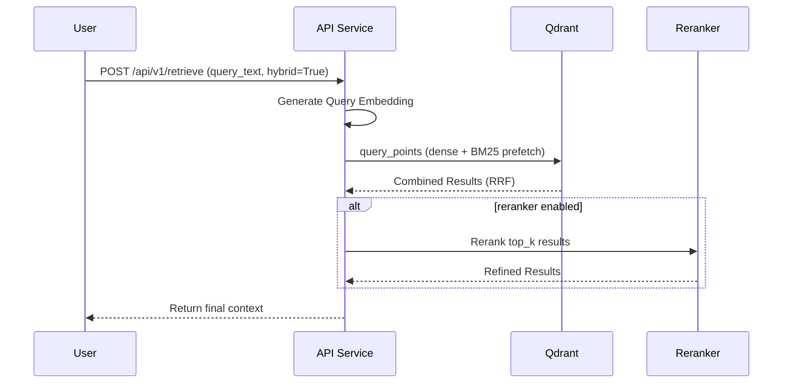

# API Service

The **API Service** acts as the primary interface for the RAG platform, providing endpoints for document retrieval and chat interactions. It is designed to expose the capabilities of the underlying vector database and language models while enforcing business logic such as filtering and reranking.

## Core Responsibilities

The API Service is responsible for:
*   **Query Processing:** Transforming user queries into vectors and executing search requests against the vector database.
*   **Hybrid Search:** Orchestrating dense (vector) and sparse (BM25) search operations in Qdrant to improve relevance.
*   **Result Reranking:** Optionally applying a reranker to the top search results to further refine accuracy.
*   **Metadata Filtering:** Applying user-defined constraints to search results.
*   **Infrastructure Management:** Managing the lifecycle of the asynchronous connection to the Qdrant database.

## Hybrid Search Mechanism

The API Service implements a hybrid search strategy to balance semantic meaning (dense) with keyword matching (sparse). This is achieved through [Qdrant](https://qdrant.tech/)'s native hybrid search capabilities:

1.  **Dense Retrieval:** The service generates a dense vector for the user's query and performs a nearest-neighbor search.
2.  **Sparse Retrieval:** Simultaneously, it leverages Qdrant's server-side BM25 indexing for sparse keyword matching.
3.  **Reciprocal Rank Fusion (RRF):** The service uses RRF as a fusion strategy to combine results from both retrieval methods, providing a robust ranking that considers both semantic similarity and keyword relevance.

### Request Flow

The following diagram illustrates the search flow in the API service:

## Configuration

The API Service is configured via `api.config` environment settings, including:
*   `qdrant_collection`: Specifies the target collection in Qdrant.
*   `qdrant_host`: Target Qdrant instance.
*   `qdrant_api_key`: Authentication for the database.
*   Reranker and Embedder configurations for the underlying ML pipeline.

## Extension Points

*   **Middleware:** The service includes custom middleware (e.g., `CorrelationAndTimingMiddleware`) for handling cross-cutting concerns like logging and security.
*   **Router Modules:** The API follows a modular structure (using FastAPI `APIRouter`) allowing for easy extension of new versions (v1, etc.) and specialized endpoints (chat vs retrieval).

## Key Components

*   **`api.main`**: Entry point and lifecycle management (Qdrant connection pooling).
*   **`api.router`**: Central router definition.
*   **`api.v1.retrieval`**: Main module responsible for hybrid search orchestration and metadata filtering logic.
*   **`rag_shared` libraries**: Shared library dependencies for embedding generation and reranking, consistent with those used in the ingestion pipeline.
