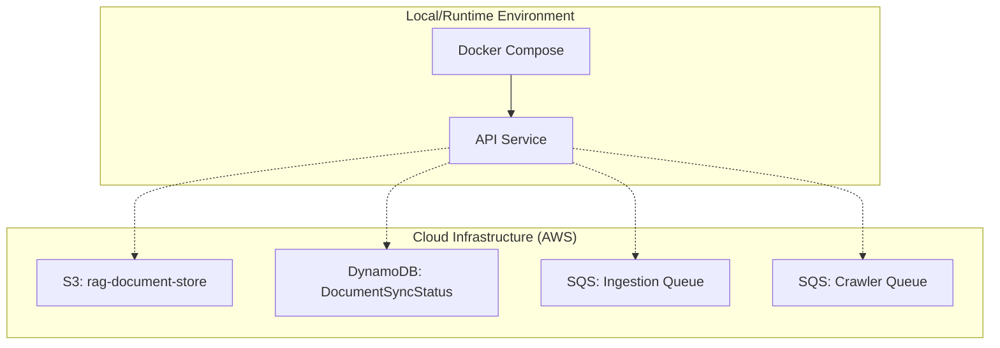

# Infrastructure

The system employs a dual-layered infrastructure approach: containerized services for local development and execution, and cloud-native AWS resources for production ingestion, managed via Infrastructure as Code (IaC).

## Infrastructure Overview

## Containerized Environment

The application runtime is managed via `docker-compose.yml`. It defines the core API services and networking, ensuring consistent behavior across local and staging environments. The `rag_network` (bridge driver) facilitates communication between services.

- **Entrypoint:** `docker-compose.yml`
- **Networking:** Dedicated `rag_network` bridge.
- **Persistence:** Local development relies on volume mounting for AWS configuration (`~/.aws:/root/.aws:ro`) to facilitate SDK interactions with cloud resources.

## AWS Infrastructure (IaC)

Cloud resources are managed using [Pulumi](https://www.pulumi.com/) with Python. This approach ensures reproducible, version-controlled state and tight coupling between application logic and infrastructure. The codebase is maintained in the `/infra/` directory.

### Key Components

*   **DynamoDB Table (`DocumentSyncStatus`):** Tracks ingestion status using `doc_id` as the hash key.
*   **S3 Bucket (`rag-document-store`):** Stores ingested raw documents.
*   **SQS Queues:**
    *   **Ingestion Queue:** Handles primary ingestion tasks (900s visibility timeout).
    *   **Crawler Queue:** Manages crawl operations (300s visibility timeout).
    *   Both queues include integrated **Dead-Letter Queues (DLQs)** with a `maxReceiveCount` of 3 to handle failed processing attempts.

### Operations

Infrastructure is managed through Pulumi stacks corresponding to environment-specific configurations (e.g., `Pulumi.dev.yaml`).

| Action | Command | Description |
| :--- | :--- | :--- |
| **Preview** | `pulumi preview` | Review pending changes. |
| **Deploy** | `pulumi up` | Apply infrastructure updates. |
| **Destroy** | `pulumi destroy` | Clean up stack resources. |

All infrastructure code must include standardized resource tags (`Environment`, `Project`) for cost and lifecycle management. See `/infra/__main__.py` for the definitive resource definitions.
