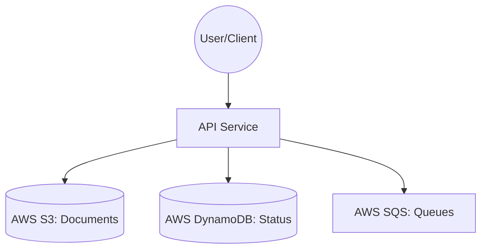

# Infrastructure Architecture

The system utilizes a dual-layer infrastructure approach: managed AWS resources for data storage and orchestration, and containerized services for application logic.

## Cloud Infrastructure (AWS)

The system uses [Pulumi](https://www.pulumi.com/) to manage AWS infrastructure as code using Python. The infrastructure codebase is located in the `/infra/` directory.

### Core AWS Components

*   **DynamoDB Table (`DocumentSyncStatus`):** Tracks the status of ingestion tasks using `doc_id` as the hash key.
*   **S3 Bucket (`rag-document-store`):** Central store for ingested documents.
*   **SQS Queues:** 
    *   **Ingestion Queue:** Processes ingestion tasks, configured with a 900s visibility timeout and a Dead-Letter Queue (DLQ).
    *   **Crawler Queue:** Processes crawler tasks, configured with a 300s visibility timeout and a DLQ.

## Deployment Environment (Docker)

Application services are containerized to ensure environment consistency. The `api-service` is defined in `/docker-compose.yml` and orchestrated via Docker.

### Service Interactions

```mermaid
graph TD
    User((User/Client)) --> API[API Service]
    API --> S3[(AWS S3: Documents)]
    API --> DDB[(AWS DynamoDB: Status)]
    API --> SQS[AWS SQS: Queues]
```

## Operations

### Infrastructure (Pulumi)

Environments are managed using Pulumi stacks (e.g., `Pulumi.dev.yaml`). To manage infrastructure, navigate to `/infra/`:

*   **Preview:** `pulumi preview`
*   **Deploy:** `pulumi up`
*   **Destroy:** `pulumi destroy`

### Services (Docker)

The `api-service` runs within a dedicated Docker network `rag_network`. Configuration is injected via environment variables (e.g., `qdrant_cluster_endpoint`, `AWS_REGION`).
