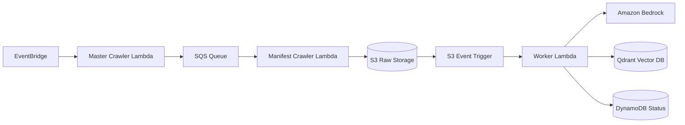

# Ingestion Pipeline

The Ingestion Pipeline is a scalable, event-driven serverless system designed to crawl, process, and embed documents for the RAG platform. By leveraging AWS serverless services, the architecture achieves high concurrency and cost efficiency.

## Overview

The pipeline automates the lifecycle of document ingestion, from URL discovery to vector database insertion. It is designed to minimize database load through manifest-based deduplication and ensure high performance by decoupling heavy dependencies.

## Core Workflow

### 1. Dispatch
The process begins with an **EventBridge Scheduler** trigger. The `master_crawl_handler` identifies target URLs and pushes individual tasks onto the `rag-crawler-queue` (SQS). This fan-out pattern enables parallel execution and improves fault tolerance.

### 2. Crawl and Deduplicate
The `manifest_crawl_handler` consumes messages from the SQS queue.
*   **Deduplication:** To avoid expensive DynamoDB lookups, the system uses an S3-based manifest. This tracks content hashes efficiently, ensuring only new or updated documents trigger downstream processing.
*   **Storage:** Raw content is saved to an S3 bucket, which subsequently triggers the processing stage.

### 3. Chunking and Embedding
An S3 event notification triggers a worker Lambda (`s3_event_handler`) when new files arrive.
*   **Transformation:** The worker fetches raw content, generates text chunks using lightweight, custom Python splitters, and invokes Amazon Bedrock to create embeddings.
*   **Persistence:** Embeddings and metadata are indexed into Qdrant. Document synchronization status is tracked in DynamoDB (`PENDING` to `COMPLETED`).

## Key Architectural Principles

*   **Decoupling Dependencies:** To optimize for speed and size, heavy libraries (such as LangChain and FastEmbed) are excluded. Lightweight alternatives and direct REST API calls are used instead.
*   **Cost Efficiency:** By utilizing S3 manifests for deduplication, the system significantly reduces DynamoDB read operations, which are a primary cost driver in high-volume ingestion.
*   **Resilience:** The use of SQS with a Dead-Letter Queue (DLQ) ensures that failed ingestion tasks are isolated and do not block the pipeline.

## Related Documentation

*   **[Ingestion Service](../services/ingestion.md):** Detailed implementation breakdown of the Lambda functions and code modules.
*   **[ADR 0001: SQS Fan-Out and S3 Manifest Deduplication](../../docs/adr/0001-manifest-crawler-sqs-fanout.md)**
*   **[ADR 0002: Decoupled Ingestion Dependencies](../../docs/adr/0002-decouple-ingestion-dependencies.md)**
