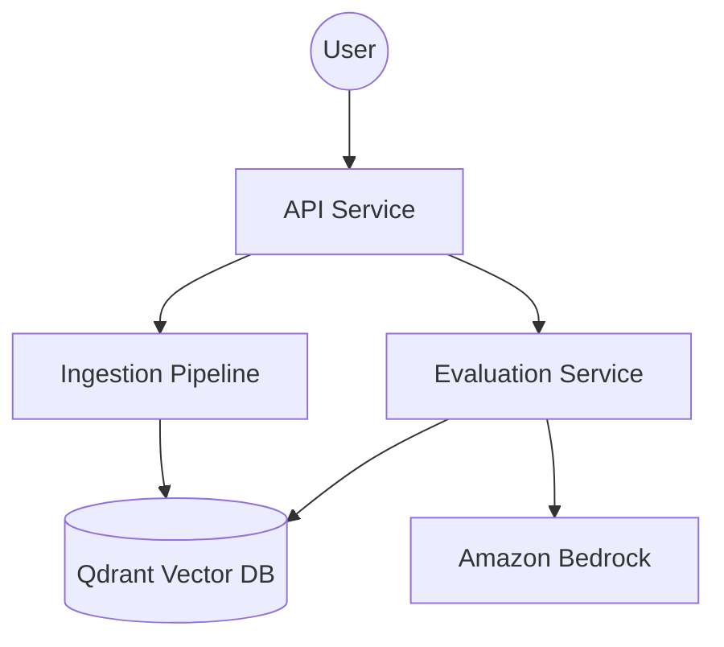
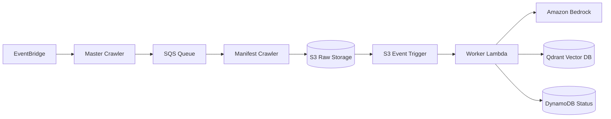

# System Architecture Overview

This document provides a high-level model of the Serverless RAG Platform's architecture. The platform is designed as a production-grade, event-driven system leveraging AWS serverless services to manage data ingestion, semantic search, and quality evaluation.

## High-Level Communication Flow

The following diagram illustrates the interaction between the system's core components.

*System component interaction diagram.*

## Component Responsibilities

*   **API Service:** Acts as the primary interface for users, providing RESTful endpoints for hybrid semantic search.
*   **Ingestion Pipeline:** Automates the end-to-end transformation of raw data into searchable vector embeddings using Amazon SQS for asynchronous, scalable processing.
*   **Evaluation Service:** Assesses retrieval and generation quality against benchmarks to ensure consistent RAG performance.

## Data Lifecycle and Control Flow

The ingestion pipeline automates the transformation of external content into searchable vector embeddings.

*Ingestion pipeline flow diagram.*

### Ingestion Pipeline Details

*   **Dispatch (EventBridge & Master Crawler):** An EventBridge Scheduler initiates a scheduled crawl. The Master Crawler Lambda identifies source URLs and dispatches them to an SQS queue.
*   **Crawling & Deduplication (SQS & Manifest Crawler):** The Manifest Crawler consumes queue messages. It performs lightweight deduplication against state manifests stored in S3, avoiding expensive database lookups. New or updated content is saved to raw storage (S3).
*   **Processing (Worker Lambda):** An S3 event trigger initiates processing. The Worker Lambda chunks the raw content, generates embeddings using Amazon Bedrock, and persists these to the Qdrant vector database.
*   **Tracking (DynamoDB):** Monitors the synchronization state of ingestion jobs.

## Architectural Design Principles

The platform's design is driven by the following core priorities:

*   **Decoupled Dependencies:** To minimize Lambda cold-starts and footprint, the pipeline avoids heavy dependencies (e.g., LangChain, FastEmbed). It uses lightweight custom splitters and direct REST integrations.
*   **Cost-Optimized Deduplication:** Utilizing S3-based manifests significantly reduces the cost of DynamoDB read operations during high-volume ingestion.
*   **Fault Tolerance:** SQS serves as a buffer between crawling and processing, with Dead-Letter Queues (DLQ) isolating failed tasks.

## Key Decisions

This architecture is governed by specific decisions:
*   **SQS Fan-Out:** Enables parallel crawling and improved throughput.
*   **Server-Side Inference:** Offloads intensive vector operations (e.g., BM25) to the Qdrant service.
