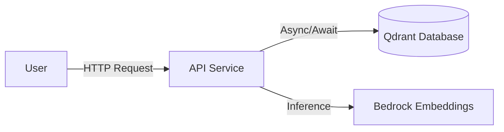

# API Service

The API Service serves as the primary entry point for the RAG platform. Built on FastAPI, it provides RESTful endpoints to facilitate semantic retrieval, chat interactions, and embedding generation.

## Architecture & Lifespan

The application uses FastAPI's `lifespan` context manager to initialize and maintain an `AsyncQdrantClient` connection pool, ensuring efficient communication with the Qdrant vector database.

## API Endpoints

Endpoints are grouped by functionality. Base routes include health checks and versioned API operations.

### Health Checks (`/health`)

*   `GET /health/liveness`: Simple liveness probe.
    *   **Returns:** `{"status": "ok", "service": "api-service"}`
*   `GET /health/readiness`: Verifies connectivity to the Qdrant database by asynchronously listing collections.
    *   **Returns:** `{"status": "ready", "database": "connected"}` or `503 Service Unavailable`.

### Core API (`/api/v1`)

The core functionality is mounted under `/api/v1`.

*   `POST /api/v1/retrieve`: Performs hybrid semantic search (dense + sparse) over the corpus.
*   `POST /api/v1/chat`: Executes chat-based queries using the RAG model pipeline.
*   `POST /api/v1/embed`: Generates embedding vectors for text inputs using the configured model.

## Core Components

The service is structured to separate concerns:

*   **`main.py`**: Initializes the FastAPI application, middleware, exception handlers, and the `lifespan` database connection.
*   **`router.py`**: Mounts versioned sub-routers (v1).
*   **`routes/health.py`**: Implements health check logic.
*   **`v1/`**: Contains core business logic for retrieval, chat, and embeddings.

## Configuration & Operations

Configuration is managed via `api.config.get_api_settings()`, which loads environment-based settings. Key configurations include `qdrant_host` and `qdrant_api_key`. The service includes a custom `CorrelationAndTimingMiddleware` for observability across requests.
