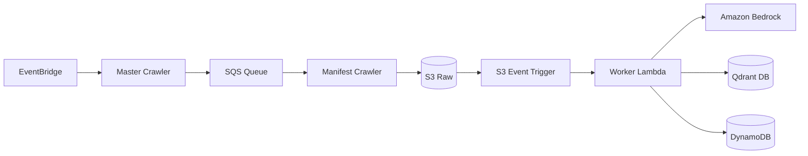

# Ingestion Service

The Ingestion Service is responsible for crawling documentation sources, processing content, and preparing it for retrieval in the RAG platform. It is a highly optimized, event-driven, serverless pipeline designed for scalability, low-latency, and minimal operating costs.

## Architecture and Control Flow

The ingestion workflow relies on asynchronous message passing and event triggers to decouple ingestion stages, allowing for massive parallelization.

### Ingestion Stages

1.  **Dispatch:** Triggered by EventBridge, `master_crawl_handler` calculates crawl targets and distributes them as messages to the `rag-crawler-queue` (SQS).
2.  **Crawl & Deduplicate:** `manifest_crawl_handler` consumes SQS messages. It performs deduplication using a manifest file in S3 to avoid unnecessary database lookups, then uploads raw content to S3.
3.  **Chunking & Embedding:** An S3 trigger invokes the `s3_event_handler`. This worker parses content, applies lightweight text splitting, generates embeddings via Amazon Bedrock, and persists data into the Qdrant vector database, updating the document lifecycle state in DynamoDB.

## Core Modules

| Module | Responsibility |
| :--- | :--- |
| `lambda_handler.py` | Orchestrates the primary Lambda entrypoints. |
| `manifest_crawler.py` | Implements URL crawling and S3-based deduplication logic. |
| `chunker.py` | Orchestrates the document-to-chunk transformation. |
| `custom_splitters.py` | Lightweight text-splitting algorithms optimized for Lambda. |
| `parser.py` | Standardizes raw document parsing and content extraction. |
| `storage.py` | Manages stateful I/O with DynamoDB and vector indexing with Qdrant. |

## Operational Principles

### Optimization and Dependencies
As specified in [ADR 0002](repo://docs/adr/0002-decouple-ingestion-dependencies.md), the service minimizes cold start times and packaging overhead by:
*   Excluding heavy external frameworks like LangChain.
*   Replacing bloated embedding libraries with direct Bedrock API calls.
*   Utilizing custom, dependency-free text splitters in `custom_splitters.py`.

### Failure Semantics
The pipeline utilizes SQS with Dead-Letter Queues (DLQ) to isolate failing ingestion tasks. State tracking in DynamoDB (`PENDING`/`COMPLETED`) allows for idempotent retry logic, ensuring documents are not double-processed or left in an inconsistent state during partial failures.
